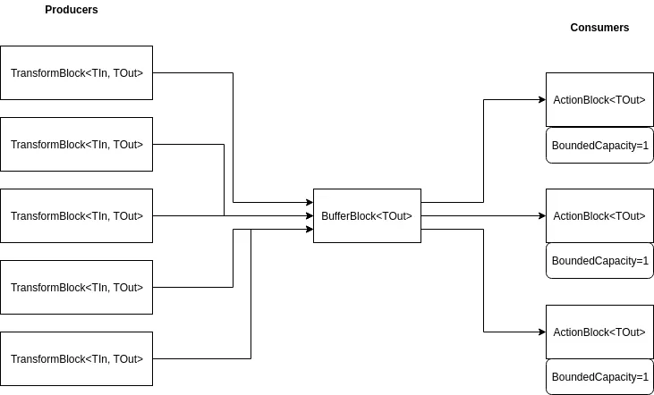

### ActionBlock
Action gibi çalışır ve bunları bir veri seti halinde tutar. Geri dönüş parametresi yoktur. İçerisindeki fonksiyonu asenkron olarak çalıştırır.
```csharp
var actionBlock = new ActionBlock<int>(n =>
{
    Task.Delay(500).Wait();
    Console.WriteLine(n); ;
});

for (int i = 0; i < 10; i++)
{
    actionBlock.Post(i);
    Console.WriteLine("Input count" + actionBlock.InputCount);
}
```


### TransformBlock
Transform block veri alır ve veri döner. Aşağıdaki kodda int değer alıp string değer dönecektir. Burada diğerlerinden faklı olarak parallelism eklenilerek multithread kullanılmıştır.

```csharp
ConcurrentBag<int> values = new ConcurrentBag<int>();
var transformBlock = new TransformBlock<int, string>(n =>
    {
        Task.Delay(500).Wait();
        values.Add(n);
        return n.ToString();
    },new ExecutionDataflowBlockOptions() { MaxDegreeOfParallelism = 8 });

for (int i = 0; i < 10; i++)
{
    transformBlock.Post(i);
    Console.WriteLine("Input count:"+transformBlock.InputCount);
}

for (int i = 0; i < 10; i++)
{
    Console.WriteLine("output count:"+transformBlock.OutputCount);
    var result = transformBlock.Receive();
    var listResult = 0;
    values.TryTake(out listResult);
    Console.WriteLine($"Result:{result}  Output count:{transformBlock.OutputCount} input count:{transformBlock.InputCount} list item: {listResult}");
}
```

<details>
<summary>Result</summary> 

```
Input count:1
Input count:1
Input count:2
Input count:2
Input count:1
Input count:2
Input count:2
Input count:2
Input count:2
Input count:3
output count:0
Result:0  Output count:7 input count:0 list item: 1
output count:7
Result:1  Output count:6 input count:0 list item: 5
output count:6
Result:2  Output count:5 input count:0 list item: 7
output count:5
Result:3  Output count:4 input count:0 list item: 6
output count:4
Result:4  Output count:3 input count:0 list item: 2
output count:3
Result:5  Output count:2 input count:0 list item: 3
output count:2
Result:6  Output count:1 input count:0 list item: 0
output count:1
Result:7  Output count:0 input count:0 list item: 4
output count:0
Result:8  Output count:1 input count:0 list item: 9
output count:1
Result:9  Output count:0 input count:0 list item: 8
Tamamlandı
```
</details>

### BatchBlock
Verileri grup halinde almak için kullanılır.
Aşağıdaki örnekte 3'erli olarak getirecektir ve son 9 değeri son 3 lü sette tek değer olacağından gelmeyecektir ve uygulama receive kısımda beklemede kalacaktır. Bu da programın çalışmasını engelleyecektir. 
```csharp
var batchBlock= new BatchBlock<int>(3);

for (int i = 0; i < 10; i++)
{
    batchBlock.Post(i);
}

for (int i = 0; i < 5; i++)
{
    int[] result = batchBlock.Receive();
    Console.Write($"Received batch {i}:");
    foreach (var r in result)
    {
        Console.Write(r+" ");
    }
    Console.Write("\n");
}
```

```
Received batch 0:0 1 2
Received batch 1:3 4 5
Received batch 2:6 7 8
```

Bunun için batchBlock.**Complete();** ve TryReceive metotları kullanılır. Burada dikkat edilmesi gereken bir noktada complete edildikten sonra post edilenlerin ignore edilmesidir.

```csharp
var batchBlock = new BatchBlock<int>(3);

for (int i = 0; i < 10; i++)
{
    batchBlock.Post(i);
}

batchBlock.Complete();

batchBlock.Post(10);
for (int i = 0; i < 5; i++)
{
    int[] result;
    if (batchBlock.TryReceive(out result))
    {
        Console.Write($"Received batch {i}:");

        foreach (var r in result)
        {
            Console.Write(r + " ");
        }
        Console.Write("\n");
    }
    else
    {
        Console.WriteLine("The block finished");
        break;
    }
}
```

```
Received batch 0:0 1 2
Received batch 1:3 4 5
Received batch 2:6 7 8
Received batch 3:9
The block finished
```

### TransformManyBlock
Batch block'un tam tersidir. Tek bir mesaj alır ve birden fazla item döner. 
Burada iki tane block var ancak bu ikisini birbirine bağlamamız gerekmektedir. Bunun için **LintTo** metodu ile source block'u consumer block'a iletebiliriz.


```csharp
public void Run()
{
    var transformManyBlock = new TransformManyBlock<int, string>(a => FindEvenNumbers(a));

    var printBlock = new ActionBlock<string>(a => Console.WriteLine($"Alınan mesaj:{a}"));

    transformManyBlock.LinkTo(printBlock);

    for (int i = 0; i < 10; i++)
    {
        transformManyBlock.Post(i);
    }
    Console.WriteLine("Tamamlandı.");
}

private IEnumerable<string> FindEvenNumbers(int number)
{
    for (int i = 0; i < number; i++)
    {
        if (i % 2 == 0)
        {
            yield return $"{number}:{i}";
        }

    }
}
```
<details>
<summary>Result</summary> 

```
Tamamlandı.
Alınan mesaj:1:0
Alınan mesaj:2:0
Alınan mesaj:3:0
Alınan mesaj:3:2
Alınan mesaj:4:0
Alınan mesaj:4:2
Alınan mesaj:5:0
Alınan mesaj:5:2
Alınan mesaj:5:4
Alınan mesaj:6:0
Alınan mesaj:6:2
Alınan mesaj:6:4
Alınan mesaj:7:0
Alınan mesaj:7:2
Alınan mesaj:7:4
Alınan mesaj:7:6
Alınan mesaj:8:0
Alınan mesaj:8:2
Alınan mesaj:8:4
Alınan mesaj:8:6
Alınan mesaj:9:0
Alınan mesaj:9:2
Alınan mesaj:9:4
Alınan mesaj:9:6
Alınan mesaj:9:8
```
</details>

Yine aynı şekilde multithread kullanmak için aşağıdaki kod kullanılabilir.
```csharp
var transformManyBlock = new TransformManyBlock<int, string>(a => FindEvenNumbers(a),
    new ExecutionDataflowBlockOptions() { MaxDegreeOfParallelism = 5 });
```

### BufferBlock
Mesajı tüketici alasıya kadar saklamada kullanılır. Örnek olarak birden fazla source block'lar (action, transformblock vs.) olsun. Bunların iletileceği consumer block'lar da tanımlansın. Bu iki block'lar arasındaki ilişki buffer block üzerinde tanımlanır. Buffer block **BoundedCapacity=1** property değeri ile alınan mesajların kaç consumer üzerine dağıtılacağını ayarlar. Bir nevi load balancer görevi görür. Default olarak öncelikle ilk consumer'a gider ve devamında consumer mesajı kabul ederse diğerlerine ilk consumer mesajı reddetmediği sürece hiçbir zaman gitmez. Bu durumda tüm alıcılarda 'BoundedCapacity' değerleri 1 olarak verildiğinde dengeli olarak mesajlar dağıtılacaktır.
https://www.blinkingcaret.com/2019/06/05/tpl-dataflow-in-net-core-in-depth-part-2/




```csharp
var bufferBlock = new BufferBlock<int>();
for (int i = 0; i < 10; i++)
{
    bufferBlock.Post(i);
}
for (int i = 0; i < 10; i++)
{
    int result = bufferBlock.Receive();
    Console.WriteLine(result);
}
```
İlgili örnekte iki action block mevcut ve buffer block ise gelen veriyi bu consumer block'lara aktaracaktır.

```csharp
var bufferBlock = new BufferBlock<int>();

var a1 = new ActionBlock<int>(a =>
    {
        Console.WriteLine($"Mesaj {a} a1 tarafından işlenildi.");
        Task.Delay(300).Wait();
    });


var a2 = new ActionBlock<int>(a =>
{
    Console.WriteLine($"Mesaj {a} a2 tarafından işlenildi.");
    Task.Delay(300).Wait();
});

bufferBlock.LinkTo(a1);
bufferBlock.LinkTo(a2);

for (int i = 0; i < 10; i++)
{
    bufferBlock.Post(i);
}
```

<details>
<summary>Result</summary> 

```
Mesaj 0 a1 tarafından işlenildi.
Mesaj 1 a1 tarafından işlenildi.
Mesaj 2 a1 tarafından işlenildi.
Mesaj 3 a1 tarafından işlenildi.
Mesaj 4 a1 tarafından işlenildi.
Mesaj 5 a1 tarafından işlenildi.
Mesaj 6 a1 tarafından işlenildi.
Mesaj 7 a1 tarafından işlenildi.
Mesaj 8 a1 tarafından işlenildi.
Mesaj 9 a1 tarafından işlenildi.
```
</details>

Burada dikkat edileceği üzere default ayarlar değiştirilmediği için her zaman ilk alıcı çalıştırılacaktır. Bunun için consumer'lar üzerinden BoundedCapacity bilgisi set edilir.

```csharp
var a1 = new ActionBlock<int>(a =>
    {
        Console.WriteLine($"Mesaj {a} a1 tarafından işlenildi.");
        Task.Delay(300).Wait();
    },new ExecutionDataflowBlockOptions() { BoundedCapacity = 1});


var a2 = new ActionBlock<int>(a =>
{
    Console.WriteLine($"Mesaj {a} a2 tarafından işlenildi.");
    Task.Delay(300).Wait();
}, new ExecutionDataflowBlockOptions() { BoundedCapacity = 1 });
```

<details>
<summary>Result</summary> 

```
Mesaj 1 a2 tarafından işlenildi.
Mesaj 0 a1 tarafından işlenildi.
Mesaj 2 a2 tarafından işlenildi.
Mesaj 3 a1 tarafından işlenildi.
Mesaj 4 a2 tarafından işlenildi.
Mesaj 5 a1 tarafından işlenildi.
Mesaj 6 a2 tarafından işlenildi.
Mesaj 7 a1 tarafından işlenildi.
Mesaj 8 a2 tarafından işlenildi.
Mesaj 9 a1 tarafından işlenildi.
```
</details>

Burada a1 e 10 değerin vermiş olsaydık hepsini a1 den işletmiş olacaktı. Çünkü gönderilen mesaj kapasitesi ve alacağı mesaj kapasitesi aynı. İlk başta sürekli a1'e düşmesinin nedeni ise default değerin -1 yani işlemsel olarak sonsuz mesajı alabiliyor olması anlamına geliyordu. Bu yüzden hiçbir zaman a2'ye düşmeyecekti.

Aynı şekilde buffer block için de BoundedCapacity ayarlayabilirdik burada BufferBlock sonsuz mesaj alırsa request çok olursa outofmemory hatası alınabilir. Ancak 1 olarak ayarladığımızda sadece bir mesajı işleyecekti. Bunun nedeni post metodu ile veri gönderdiğimizde bu metot eğer kapasite dolmuşsa gönderim reddedilecek ve false dönecektir. Bu durumda mesajları reject olmadan SendAsync() metodu aracılığıyla göderebiliriz. Bu şekilde BoundedCapacity 1 bile olsa bir mesaj gönderildikten sonra bir diğerini gönderebilir.

```csharp
var bufferBlock = new BufferBlock<int>(new DataflowBlockOptions() { BoundedCapacity = 1 });

var a1 = new ActionBlock<int>(a =>
    {
        Console.WriteLine($"Mesaj {a} a1 tarafından işlenildi.");
        Task.Delay(300).Wait();
    },new ExecutionDataflowBlockOptions() { BoundedCapacity = 1});


var a2 = new ActionBlock<int>(a =>
{
    Console.WriteLine($"Mesaj {a} a2 tarafından işlenildi.");
    Task.Delay(300).Wait();
}, new ExecutionDataflowBlockOptions() { BoundedCapacity = 1 });

bufferBlock.LinkTo(a1);
bufferBlock.LinkTo(a2);

for (int i = 0; i < 10; i++)
{
    bufferBlock.SendAsync(i).ContinueWith(a =>
    {
        if (a.Result)
        {
            Console.WriteLine($"{i} mesajı kabul edildi.");
        }
        else
        {
            Console.WriteLine($"{i} mesajı reddedildi.");
        }
    });
}
```

<details>
<summary>Result</summary> 

```
Tamamlandı
1 mesajı kabul edildi.
Mesaj 0 a1 tarafından işlenildi.
Mesaj 1 a2 tarafından işlenildi.
10 mesajı kabul edildi.
10 mesajı kabul edildi.
Mesaj 2 a1 tarafından işlenildi.
10 mesajı kabul edildi.
10 mesajı kabul edildi.
Mesaj 3 a2 tarafından işlenildi.
Mesaj 4 a1 tarafından işlenildi.
10 mesajı kabul edildi.
Mesaj 5 a2 tarafından işlenildi.
10 mesajı kabul edildi.
Mesaj 6 a1 tarafından işlenildi.
10 mesajı kabul edildi.
Mesaj 7 a2 tarafından işlenildi.
10 mesajı kabul edildi.
Mesaj 8 a1 tarafından işlenildi.
10 mesajı kabul edildi.
Mesaj 9 a2 tarafından işlenildi.
```
</details>


### BroadcastBlock
Mesajı birden fazla alıcıya gönderir. Burada mesajdan kasıt class instance'larıdır. Gönderilen mesaj birden fazla alıcıya ulaştığında her bir mesaj aynı instance'ı paylaşır.

```csharp
var broadcastBlock = new BroadcastBlock<int>(a => a, new DataflowBlockOptions() { BoundedCapacity = 1 });

var a1 = new ActionBlock<int>(a =>
{
    Console.WriteLine($"Mesaj {a} a1 tarafından işlenildi.");
    Task.Delay(300).Wait();
}, new ExecutionDataflowBlockOptions() { BoundedCapacity = 1 });


var a2 = new ActionBlock<int>(a =>
{
    Console.WriteLine($"Mesaj {a} a2 tarafından işlenildi.");
    Task.Delay(300).Wait();
}, new ExecutionDataflowBlockOptions() { BoundedCapacity = 1 });

broadcastBlock.LinkTo(a1);
broadcastBlock.LinkTo(a2);

for (int i = 0; i < 10; i++)
{
    broadcastBlock.SendAsync(i).ContinueWith(a =>
    {
        if (a.Result)
        {
            Console.WriteLine($"{i} mesajı kabul edildi.");
        }
        else
        {
            Console.WriteLine($"{i} mesajı reddedildi.");
        }
    });
}
```
Burada tüm mesajların başarılı bir şekilde kabul edildi ancak sadece ikisi işlenildir.

<details>
<summary>Result</summary> 

```
1 mesajı kabul edildi.
Tamamlandı
10 mesajı kabul edildi.
10 mesajı kabul edildi.
10 mesajı kabul edildi.
10 mesajı kabul edildi.
10 mesajı kabul edildi.
10 mesajı kabul edildi.
10 mesajı kabul edildi.
10 mesajı kabul edildi.
10 mesajı kabul edildi.
Mesaj 0 a1 tarafından işlenildi.
Mesaj 0 a2 tarafından işlenildi.
Mesaj 9 a1 tarafından işlenildi.
Mesaj 9 a2 tarafından işlenildi.
```
</details>

Bir mesaj bir yerden reject aldığında tekrar gönderim yapılmaz. Eğer boundedcapacity değerleri kaldırılırsa işleyiş de değişecektir.

```csharp
var broadcastBlock = new BroadcastBlock<int>(a => a);

var a1 = new ActionBlock<int>(a =>
{
    Console.WriteLine($"Mesaj {a} a1 tarafından işlenildi.");
    Task.Delay(300).Wait();
});


var a2 = new ActionBlock<int>(a =>
{
    Console.WriteLine($"Mesaj {a} a2 tarafından işlenildi.");
    Task.Delay(300).Wait();
});
```
<details>
<summary>Result</summary> 

```
10 mesajı kabul edildi.
Tamamlandı
8 mesajı kabul edildi.
8 mesajı kabul edildi.
8 mesajı kabul edildi.
10 mesajı kabul edildi.
9 mesajı kabul edildi.
10 mesajı kabul edildi.
10 mesajı kabul edildi.
10 mesajı kabul edildi.
10 mesajı kabul edildi.
Mesaj 0 a2 tarafından işlenildi.
Mesaj 0 a1 tarafından işlenildi.
Mesaj 1 a1 tarafından işlenildi.
Mesaj 1 a2 tarafından işlenildi.
Mesaj 2 a1 tarafından işlenildi.
Mesaj 2 a2 tarafından işlenildi.
Mesaj 3 a1 tarafından işlenildi.
Mesaj 3 a2 tarafından işlenildi.
Mesaj 4 a1 tarafından işlenildi.
Mesaj 4 a2 tarafından işlenildi.
Mesaj 5 a2 tarafından işlenildi.
Mesaj 5 a1 tarafından işlenildi.
Mesaj 6 a2 tarafından işlenildi.
Mesaj 6 a1 tarafından işlenildi.
Mesaj 7 a1 tarafından işlenildi.
Mesaj 7 a2 tarafından işlenildi.
Mesaj 8 a1 tarafından işlenildi.
Mesaj 8 a2 tarafından işlenildi.
Mesaj 9 a1 tarafından işlenildi.
Mesaj 9 a2 tarafından işlenildi.
```
</details>

### JoinBlock

JoinBlock birden fazla blockları birleştirerek başka block'a aktarımı mümkün kılar.

```csharp
var broadcastBlock = new BroadcastBlock<int>(a => a);

var a1 = new TransformBlock<int,int>(a =>
{
    Console.WriteLine($"Mesaj {a} a1 tarafından işlenilmekte.");
    Task.Delay(300).Wait();
    return a;
});


var a2 = new TransformBlock<int,int>(a =>
{
    Console.WriteLine($"Mesaj {a} a2 tarafından işlenilmekte.");
    Task.Delay(300).Wait();
    return a;
});

broadcastBlock.LinkTo(a1);
broadcastBlock.LinkTo(a2);

var joinBlock = new JoinBlock<int, int>();
a1.LinkTo(joinBlock.Target1);
a2.LinkTo(joinBlock.Target2);
var printBlock = new ActionBlock<Tuple<int,int>>(a => Console.WriteLine($"{a} mesajı print block tarafından işlenildi."));

joinBlock.LinkTo(printBlock);

for (int i = 0; i < 10; i++)
{
    broadcastBlock.SendAsync(i).ContinueWith(a =>
    {
        if (a.Result)
        {
            Console.WriteLine($"{i} mesajı kabul edildi.");
        }
        else
        {
            Console.WriteLine($"{i} mesajı reddedildi.");
        }
    });
}
```

<details>
<summary>Result</summary> 

```
Tamamlandı
4 mesajı kabul edildi.
4 mesajı kabul edildi.
4 mesajı kabul edildi.
4 mesajı kabul edildi.
8 mesajı kabul edildi.
10 mesajı kabul edildi.
10 mesajı kabul edildi.
10 mesajı kabul edildi.
10 mesajı kabul edildi.
10 mesajı kabul edildi.
Mesaj 0 a1 tarafından işlenilmekte.
Mesaj 0 a2 tarafından işlenilmekte.
Mesaj 1 a2 tarafından işlenilmekte.
Mesaj 1 a1 tarafından işlenilmekte.
(0, 0) mesajı print block tarafından işlenildi.
Mesaj 2 a2 tarafından işlenilmekte.
Mesaj 2 a1 tarafından işlenilmekte.
(1, 1) mesajı print block tarafından işlenildi.
Mesaj 3 a2 tarafından işlenilmekte.
Mesaj 3 a1 tarafından işlenilmekte.
(2, 2) mesajı print block tarafından işlenildi.
Mesaj 4 a2 tarafından işlenilmekte.
Mesaj 4 a1 tarafından işlenilmekte.
(3, 3) mesajı print block tarafından işlenildi.
Mesaj 5 a1 tarafından işlenilmekte.
Mesaj 5 a2 tarafından işlenilmekte.
(4, 4) mesajı print block tarafından işlenildi.
Mesaj 6 a2 tarafından işlenilmekte.
Mesaj 6 a1 tarafından işlenilmekte.
(5, 5) mesajı print block tarafından işlenildi.
Mesaj 7 a1 tarafından işlenilmekte.
Mesaj 7 a2 tarafından işlenilmekte.
(6, 6) mesajı print block tarafından işlenildi.
Mesaj 8 a1 tarafından işlenilmekte.
Mesaj 8 a2 tarafından işlenilmekte.
(7, 7) mesajı print block tarafından işlenildi.
Mesaj 9 a1 tarafından işlenilmekte.
(8, 8) mesajı print block tarafından işlenildi.
Mesaj 9 a2 tarafından işlenilmekte.
(9, 9) mesajı print block tarafından işlenildi.
```
</details>

Multithread ve çalışma sürelerinde biraz oynama yaparsak çalışma sırası yine değişmeyecektir.
```csharp
var broadcastBlock = new BroadcastBlock<int>(a => a);

var a1 = new TransformBlock<int,int>(a =>
{
    Console.WriteLine($"Mesaj {a} a1 tarafından işlenilmekte.");
    Task.Delay(300).Wait();
    if (a%2==0)
    {
        Task.Delay(300).Wait();
    }
    else
    {
        Task.Delay(50).Wait();
    }
    return -a;
},new ExecutionDataflowBlockOptions() { MaxDegreeOfParallelism = 3 });


var a2 = new TransformBlock<int,int>(a =>
{
    Console.WriteLine($"Mesaj {a} a2 tarafından işlenilmekte.");
    Task.Delay(150).Wait();
    return a;
}, new ExecutionDataflowBlockOptions() { MaxDegreeOfParallelism = 8 });

broadcastBlock.LinkTo(a1);
broadcastBlock.LinkTo(a2);

var joinBlock = new JoinBlock<int, int>();
a1.LinkTo(joinBlock.Target1);
a2.LinkTo(joinBlock.Target2);
var printBlock = new ActionBlock<Tuple<int,int>>(a => Console.WriteLine($"{a} mesajı print block tarafından işlenildi. Değerler toplamı her zaman 0 dönecektir: {a.Item1+a.Item2}"));

joinBlock.LinkTo(printBlock);

for (int i = 0; i < 10; i++)
{
    broadcastBlock.SendAsync(i).ContinueWith(a =>
    {
        if (a.Result)
        {
            Console.WriteLine($"{i} mesajı kabul edildi.");
        }
        else
        {
            Console.WriteLine($"{i} mesajı reddedildi.");
        }
    });
}

```

<details>
<summary>Result</summary> 

```
6 mesajı kabul edildi.
Tamamlandı
10 mesajı kabul edildi.
4 mesajı kabul edildi.
6 mesajı kabul edildi.
6 mesajı kabul edildi.
10 mesajı kabul edildi.
10 mesajı kabul edildi.
10 mesajı kabul edildi.
10 mesajı kabul edildi.
10 mesajı kabul edildi.
Mesaj 0 a2 tarafından işlenilmekte.
Mesaj 2 a2 tarafından işlenilmekte.
Mesaj 1 a2 tarafından işlenilmekte.
Mesaj 3 a2 tarafından işlenilmekte.
Mesaj 4 a2 tarafından işlenilmekte.
Mesaj 0 a1 tarafından işlenilmekte.
Mesaj 1 a1 tarafından işlenilmekte.
Mesaj 2 a1 tarafından işlenilmekte.
Mesaj 5 a2 tarafından işlenilmekte.
Mesaj 6 a2 tarafından işlenilmekte.
Mesaj 7 a2 tarafından işlenilmekte.
Mesaj 8 a2 tarafından işlenilmekte.
Mesaj 9 a2 tarafından işlenilmekte.
Mesaj 3 a1 tarafından işlenilmekte.
Mesaj 4 a1 tarafından işlenilmekte.
Mesaj 5 a1 tarafından işlenilmekte.
(0, 0) mesajı print block tarafından işlenildi. Değerler toplamı her zaman 0 dönecektir: 0
(-1, 1) mesajı print block tarafından işlenildi. Değerler toplamı her zaman 0 dönecektir: 0
(-2, 2) mesajı print block tarafından işlenildi. Değerler toplamı her zaman 0 dönecektir: 0
Mesaj 6 a1 tarafından işlenilmekte.
(-3, 3) mesajı print block tarafından işlenildi. Değerler toplamı her zaman 0 dönecektir: 0
Mesaj 7 a1 tarafından işlenilmekte.
Mesaj 8 a1 tarafından işlenilmekte.
(-4, 4) mesajı print block tarafından işlenildi. Değerler toplamı her zaman 0 dönecektir: 0
(-5, 5) mesajı print block tarafından işlenildi. Değerler toplamı her zaman 0 dönecektir: 0
Mesaj 9 a1 tarafından işlenilmekte.
(-6, 6) mesajı print block tarafından işlenildi. Değerler toplamı her zaman 0 dönecektir: 0
(-7, 7) mesajı print block tarafından işlenildi. Değerler toplamı her zaman 0 dönecektir: 0
(-8, 8) mesajı print block tarafından işlenildi. Değerler toplamı her zaman 0 dönecektir: 0
(-9, 9) mesajı print block tarafından işlenildi. Değerler toplamı her zaman 0 dönecektir: 0
```
</details>

### BatchedJoinBlock
JoingBlock gibi çalışır ama BatchedBlock gibi birden fazla öğeyi toplu halde alarak işlem yapar. Ancak burada sıralama her çalışmada farklı çalışacaktır.
```csharp
var broadcastBlock = new BroadcastBlock<int>(a => a);

var a1 = new TransformBlock<int, int>(a =>
{
    Console.WriteLine($"Mesaj {a} a1 tarafından işlenilmekte.");
    Task.Delay(300).Wait();
    if (a % 2 == 0)
    {
        Task.Delay(300).Wait();
    }
    else
    {
        Task.Delay(50).Wait();
    }
    return -a;
}, new ExecutionDataflowBlockOptions() { MaxDegreeOfParallelism = 3 });


var a2 = new TransformBlock<int, int>(a =>
{
    Console.WriteLine($"Mesaj {a} a2 tarafından işlenilmekte.");
    Task.Delay(150).Wait();
    return a;
}, new ExecutionDataflowBlockOptions() { MaxDegreeOfParallelism = 3 });

broadcastBlock.LinkTo(a1);
broadcastBlock.LinkTo(a2);

var joinBlock = new BatchedJoinBlock<int, int>(3);
a1.LinkTo(joinBlock.Target1);
a2.LinkTo(joinBlock.Target2);
var printBlock = new ActionBlock<Tuple<IList<int>, IList<int>>>(a => Console.WriteLine($"{a} mesajı print block tarafından işlenildi.[{string.Join(',', a.Item1)}] , [{string.Join(',', a.Item2)}]"));

joinBlock.LinkTo(printBlock);

for (int i = 0; i < 10; i++)
{
    broadcastBlock.SendAsync(i).ContinueWith(a =>
    {
        if (a.Result)
        {
            Console.WriteLine($"{i} mesajı kabul edildi.");
        }
        else
        {
            Console.WriteLine($"{i} mesajı reddedildi.");
        }
    });
}
```

<details>
<summary>Result</summary> 

```
2 mesajı kabul edildi.
4 mesajı kabul edildi.
3 mesajı kabul edildi.
6 mesajı kabul edildi.
6 mesajı kabul edildi.
9 mesajı kabul edildi.
Tamamlandı
10 mesajı kabul edildi.
10 mesajı kabul edildi.
10 mesajı kabul edildi.
10 mesajı kabul edildi.
Mesaj 0 a2 tarafından işlenilmekte.
Mesaj 1 a2 tarafından işlenilmekte.
Mesaj 2 a2 tarafından işlenilmekte.
Mesaj 0 a1 tarafından işlenilmekte.
Mesaj 2 a1 tarafından işlenilmekte.
Mesaj 1 a1 tarafından işlenilmekte.
Mesaj 3 a2 tarafından işlenilmekte.
Mesaj 4 a2 tarafından işlenilmekte.
Mesaj 5 a2 tarafından işlenilmekte.
Mesaj: [] , [0,1,2]
Mesaj 6 a2 tarafından işlenilmekte.
Mesaj 7 a2 tarafından işlenilmekte.
Mesaj 8 a2 tarafından işlenilmekte.
Mesaj: [] , [3,4,5]
Mesaj 3 a1 tarafından işlenilmekte.
Mesaj 9 a2 tarafından işlenilmekte.
Mesaj: [] , [6,7,8]
Mesaj 4 a1 tarafından işlenilmekte.
Mesaj 5 a1 tarafından işlenilmekte.
Mesaj: [0,-1,-2] , []
Mesaj 6 a1 tarafından işlenilmekte.
Mesaj 7 a1 tarafından işlenilmekte.
Mesaj 8 a1 tarafından işlenilmekte.
Mesaj: [-3,-4] , [9]
Mesaj 9 a1 tarafından işlenilmekte.
Mesaj: [-5,-6,-7] , []
```
</details>

### WriteOnceBlock
Adından da anlaşılacağı gibi tek bir mesajı kabul eder ve diğerlerini reddeder ve aynı yanıtı döner.

```csharp
var block = new WriteOnceBlock<int>(a => a);
for (int i = 0; i < 10; i++)
{
    if (block.Post(i))
    {
        Console.WriteLine($"Mesaj {i} kabul edildi");
    }
    else
    {
        Console.WriteLine($"Mesaj {i} reddedildi");
    }
}
for (int i = 0; i < 15; i++)
{
    if (block.TryReceive(out var ret))
    {
        Console.WriteLine($"Mesaj {ret} kabul edildi. Iteration {i}");
    }
    else
    {
        Console.WriteLine("Mesaj alınamadı.");
    }
}
```
<details>
<summary>Result</summary> 

```
Mesaj 0 kabul edildi
Mesaj 1 reddedildi
Mesaj 2 reddedildi
Mesaj 3 reddedildi
Mesaj 4 reddedildi
Mesaj 5 reddedildi
Mesaj 6 reddedildi
Mesaj 7 reddedildi
Mesaj 8 reddedildi
Mesaj 9 reddedildi
Mesaj 0 kabul edildi. Iteration 0
Mesaj 0 kabul edildi. Iteration 1
Mesaj 0 kabul edildi. Iteration 2
Mesaj 0 kabul edildi. Iteration 3
Mesaj 0 kabul edildi. Iteration 4
Mesaj 0 kabul edildi. Iteration 5
Mesaj 0 kabul edildi. Iteration 6
Mesaj 0 kabul edildi. Iteration 7
Mesaj 0 kabul edildi. Iteration 8
Mesaj 0 kabul edildi. Iteration 9
Mesaj 0 kabul edildi. Iteration 10
Mesaj 0 kabul edildi. Iteration 11
Mesaj 0 kabul edildi. Iteration 12
Mesaj 0 kabul edildi. Iteration 13
Mesaj 0 kabul edildi. Iteration 14
Tamamlandı
```
</details>

Eğer receive metodu yerine başka bir block'a gönderim yapacak olsaydık sadece tek bir sefer çalıştığını görebiliriz.
```csharp
var block = new WriteOnceBlock<int>(a => a);
var print = new ActionBlock<int>(a => Console.WriteLine($"Mesaj {a} kabul edildi."));
for (int i = 0; i < 10; i++)
{
    if (block.Post(i))
    {
        Console.WriteLine($"Mesaj {i} kabul edildi");
    }
    else
    {
        Console.WriteLine($"Mesaj {i} reddedildi");
    }
}
block.LinkTo(print);
```

<details>
<summary>Result</summary> 

```
Mesaj 0 kabul edildi
Mesaj 1 reddedildi
Mesaj 2 reddedildi
Mesaj 3 reddedildi
Mesaj 4 reddedildi
Mesaj 5 reddedildi
Mesaj 6 reddedildi
Mesaj 7 reddedildi
Mesaj 8 reddedildi
Mesaj 9 reddedildi
Tamamlandı
Mesaj 0 kabul edildi.
```
</details>

### Completion
BroadcastBlock örneğindeki sendasync metodunu aşağıdaki gibi değiştirelim. Bu durumda Console.ReadLine kodunu kaldırdığımızda ilgili mesaj bilgileri ekrana yazılmayacaktır. Bunun nedeni ilgili kod bloğunun farklı thread'de çalışmasıdır ve ReadLine ile bir bekleme yaptığımız için sonuçları görüntüleyebiliyorduk ancak bu kodu kaldırdığımızda kodu bekleten bir şey olmadığı için sonuç ekrana yansımadan Main metodu tamamlanmış olacaktır. Bunu çözmek için ilgili thread'de çalışan kodun tamamlanmasını beklememiz gerekmektedir.
```csharp
var broadcastBlock = new BroadcastBlock<int>(a => a);

var a1 = new ActionBlock<int>(a =>
{
    Console.WriteLine($"Mesaj {a} a1 tarafından işlenildi.");
    Task.Delay(300).Wait();
});


var a2 = new ActionBlock<int>(a =>
{
    Console.WriteLine($"Mesaj {a} a2 tarafından işlenildi.");
    Task.Delay(300).Wait();
});

broadcastBlock.LinkTo(a1);
broadcastBlock.LinkTo(a2);

for (int i = 0; i < 10; i++)
{
    await broadcastBlock.SendAsync(i);
}
Console.WriteLine("Tamamlandı");
//Console.ReadLine();
```


```
Tamamlandı

C:\Users\Nuri\...\TPL DataFlow\DataDlow\DataDlow\bin\Debug\netcoreapp3.1\DataDlow.exe (process 18700) exited with code 0.
To automatically close the console when debugging stops, enable Tools->Options->Debugging->Automatically close the console when debugging stops.
Press any key to close this window . .

```

Block'un süreçlerinin tamamlanıp tamamlanmadığını öğrenmek için block içerisinde mesajın olup olmadığına ya da completed eventi kontrol edilir. Bunun için linkto içerisinde **PropagateCompletion** true olarak set edilmeli ve *broadcastBlock.Complete(); finalBlock.Completion.Wait();* metotları çağırılmalıdır.
```csharp
public static class LinktoWithPropagationExtension
{
    public static IDisposable LinkToWithPropagation<T>(this ISourceBlock<T> source,ITargetBlock<T> target)
    {
        return source.LinkTo(target, new DataflowLinkOptions()
        {
            PropagateCompletion = true
        });
    }
}


var broadcastBlock = new BroadcastBlock<int>(a => a);

var a1 = new TransformBlock<int, int>(a =>
{
    Console.WriteLine($"Mesaj {a} a1 tarafından işlenildi.");
    Task.Delay(300).Wait();
    return -a;
});


var a2 = new TransformBlock<int, int>(a =>
{
    Console.WriteLine($"Mesaj {a} a2 tarafından işlenildi.");
    Task.Delay(300).Wait();
    return a;
});


var joinBlock = new JoinBlock<int, int>();
a1.LinkToWithPropagation(joinBlock.Target1);
a2.LinkToWithPropagation(joinBlock.Target2);

broadcastBlock.LinkToWithPropagation(a1);
broadcastBlock.LinkToWithPropagation(a2);

var finalBlock = new ActionBlock<Tuple<int, int>>(a =>
    {
        Console.WriteLine($"{a.Item1}: tüm consumer'lar tarafından işlenildi");
    });

joinBlock.LinkToWithPropagation(finalBlock);

for (int i = 0; i < 10; i++)
{
    await broadcastBlock.SendAsync(i);
}

broadcastBlock.Complete();
finalBlock.Completion.Wait();

```
### Append
Append bağlanan consumer ilişkisini önceliklendirmek ya da kaldırmak için kullanılır. Aşağıdaki bufferblock için görüleceği üzere sadece a1 mesajları gelmektedir.

```csharp
var bufferBlock = new BufferBlock<int>();

var a1 = new ActionBlock<int>(a =>
{
    Console.WriteLine($"Mesaj {a} a1 tarafından işlenildi.");
});


var a2 = new ActionBlock<int>(a =>
{
    Console.WriteLine($"Mesaj {a} a2 tarafından işlenildi.");
});

bufferBlock.LinkTo(a1);
bufferBlock.LinkTo(a2);

for (int i = 0; i < 10; i++)
{
    await bufferBlock.SendAsync(i);
}
```

<details>
<summary>Result</summary> 

```
Tamamlandı
Mesaj 0 a1 tarafından işlenildi.
Mesaj 1 a1 tarafından işlenildi.
Mesaj 2 a1 tarafından işlenildi.
Mesaj 3 a1 tarafından işlenildi.
Mesaj 4 a1 tarafından işlenildi.
Mesaj 5 a1 tarafından işlenildi.
Mesaj 6 a1 tarafından işlenildi.
Mesaj 7 a1 tarafından işlenildi.
Mesaj 8 a1 tarafından işlenildi.
Mesaj 9 a1 tarafından işlenildi.
```
</details>


Append false yapılırsa a1 den önce a2 ilişkisi bağlanacaktır. Bu şekilde sonuçların hepsi a2 tarafından çalıştırılacaktır.

```csharp
bufferBlock.LinkTo(a2,new DataflowLinkOptions() { Append = false });
```
<details>
<summary>Result</summary> 

```
Tamamlandı
Mesaj 0 a2 tarafından işlenildi.
Mesaj 1 a2 tarafından işlenildi.
Mesaj 2 a2 tarafından işlenildi.
Mesaj 3 a2 tarafından işlenildi.
Mesaj 4 a2 tarafından işlenildi.
Mesaj 5 a2 tarafından işlenildi.
Mesaj 6 a2 tarafından işlenildi.
Mesaj 7 a2 tarafından işlenildi.
Mesaj 8 a2 tarafından işlenildi.
Mesaj 9 a2 tarafından işlenildi.
```
</details>

### MaxMessages
Block tarafından alınacak mesajları sınırlamak için kullanılır. Aşağıdaki örnekte a2 için maksimum 5 mesaj alınır.

```csharp
bufferBlock.LinkTo(a2, new DataflowLinkOptions()
{
    Append = false,
    MaxMessages = 5
});
```

<details>
<summary>Result</summary> 

```
Tamamlandı
Mesaj 5 a1 tarafından işlenildi.
Mesaj 0 a2 tarafından işlenildi.
Mesaj 1 a2 tarafından işlenildi.
Mesaj 2 a2 tarafından işlenildi.
Mesaj 3 a2 tarafından işlenildi.
Mesaj 4 a2 tarafından işlenildi.
Mesaj 6 a1 tarafından işlenildi.
Mesaj 7 a1 tarafından işlenildi.
Mesaj 8 a1 tarafından işlenildi.
Mesaj 9 a1 tarafından işlenildi.
```

</details> 

### Mesaage Filtering

```csharp
bufferBlock.LinkTo(a1, a => a % 2 == 0);
```

```
Tamamlandı
Mesaj 0 a2 tarafından işlenildi.
Mesaj 1 a2 tarafından işlenildi.
Mesaj 2 a2 tarafından işlenildi.
Mesaj 3 a2 tarafından işlenildi.
Mesaj 4 a2 tarafından işlenildi.
```
Sonuç ne yazıkki istediğimiz gibi olmadı. Bunun nedeni bir önceki kodda da anlaşılacağı üzere ilk 5 mesajı a2 işliyor. a1 tarafına 5 msajı geliyor ve filtreden geçemiyor ve geçemediği için beklemede kalıyor ve dolayısıyla a1 tamamlanamıyor.

Bunun için aşağıdaki gibi NullTarget DataFlowBlock eklenebilir. Bu bize reddidilmiş olan block'lar için tamamlanabilir bir block sağlamış olacaktır. Bu block'u da aşağıdaki gibi LinkTo ile bağlayalım
```csharp
bufferBlock.LinkTo(a1, a => a % 2 == 0);
bufferBlock.LinkTo(a2, new DataflowLinkOptions()
{
    Append = false,
    MaxMessages = 4
});

bufferBlock.LinkTo(DataflowBlock.NullTarget<int>());
for (int i = 0; i < 10; i++)
{
    await bufferBlock.SendAsync(i);
}
```

```
Tamamlandı
Mesaj 4 a1 tarafından işlenildi.
Mesaj 0 a2 tarafından işlenildi.
Mesaj 1 a2 tarafından işlenildi.
Mesaj 2 a2 tarafından işlenildi.
Mesaj 3 a2 tarafından işlenildi.
Mesaj 6 a1 tarafından işlenildi.
Mesaj 8 a1 tarafından işlenildi.
```
NullTarget yerine herhangi bir action block koyduğumuzda bu block reddedilen mesajları alacaktır.

```csharp
bufferBlock.LinkTo(new ActionBlock<int>(a => Console.WriteLine($"{a} mesajı reddedildi.")));
```

```
Tamamlandı
Mesaj 4 a1 tarafından işlenildi.
5 mesajı reddedildi.
7 mesajı reddedildi.
9 mesajı reddedildi.
Mesaj 0 a2 tarafından işlenildi.
Mesaj 1 a2 tarafından işlenildi.
Mesaj 2 a2 tarafından işlenildi.
Mesaj 3 a2 tarafından işlenildi.
Mesaj 6 a1 tarafından işlenildi.
Mesaj 8 a1 tarafından işlenildi.
```

### Multiple Producers
Daha önceki örneklerde birden fazla consumer ve bir producer vardı.
Aşağıdaki gibi LinkTo ile iki producer'ı aynı consumer'a aktarabiliriz.
```csharp
var producer1 = new TransformBlock<string,string>(a =>
{
    Task.Delay(150).Wait();
    return a;
});

var producer2 = new TransformBlock<string, string>(a =>
{
    Task.Delay(300).Wait();
    return a;
});

var printBlock = new ActionBlock<string>(n => Console.WriteLine(n));
producer1.LinkTo(printBlock);
producer2.LinkTo(printBlock);

for (int i = 0; i < 10; i++)
{
    producer1.Post($"Producer 1 mesajı: {i}");
    producer2.Post($"Producer 2 mesajı: {i}");
}
```

<details>
<summary>Result</summary> 

```
Tamamlandı
Producer 1 mesajı: 0
Producer 2 mesajı: 0
Producer 1 mesajı: 1
Producer 1 mesajı: 2
Producer 2 mesajı: 1
Producer 1 mesajı: 3
Producer 1 mesajı: 4
Producer 2 mesajı: 2
Producer 1 mesajı: 5
Producer 1 mesajı: 6
Producer 2 mesajı: 3
Producer 1 mesajı: 7
Producer 1 mesajı: 8
Producer 2 mesajı: 4
Producer 1 mesajı: 9
Producer 2 mesajı: 5
Producer 2 mesajı: 6
Producer 2 mesajı: 7
Producer 2 mesajı: 8
Producer 2 mesajı: 9
```

</details>

Kod içerisine completion metotlarını ekleyelim. Burada completion için oluşturduğumuz extension metot ile PropagateCompletion değerini güncellediğimizi de unutmayalım.

```csharp
var printBlock = new ActionBlock<string>(n => Console.WriteLine(n));
producer1.LinkToWithPropagation(printBlock);
producer2.LinkToWithPropagation(printBlock);

for (int i = 0; i < 10; i++)
{
    producer1.Post($"Producer 1 mesajı: {i}");
    producer2.Post($"Producer 2 mesajı: {i}");
}
producer1.Complete();
producer2.Complete();
printBlock.Completion.Wait();
```
Sonuç ne yazıkki istediğimiz gibi olmadı. Bazı mesajlar eksik kaldı. Bunun nedeni producer1 in tamamlandı komutunu göndermesiyle consumer'ın da tamamlanması. Burada süreç tek yönlü olduğu için consumer producer2 ye tamamlanıp tamamlanmadığını sormadığından tamamlandı olarak kabul edip yoluna devam etmekte.

<details>
<summary>Result</summary> 

```
Producer 1 mesajı: 0
Producer 1 mesajı: 1
Producer 2 mesajı: 0
Producer 1 mesajı: 2
Producer 2 mesajı: 1
Producer 1 mesajı: 3
Producer 1 mesajı: 4
Producer 2 mesajı: 2
Producer 1 mesajı: 5
Producer 1 mesajı: 6
Producer 2 mesajı: 3
Producer 1 mesajı: 7
Producer 1 mesajı: 8
Producer 2 mesajı: 4
Producer 1 mesajı: 9
Tamamlandı
```
</details>

TPL Dataflow'u bir push mimarisidir. Producer consumer'ı bilir ancak tersi mümkün değildir. Bu yüzden PropagateCompletion değeri default olarak false'dur. Buradaki senaryo için TPL tarafında hazır bir çözüm olmasa da Task.WhenAll ile her iki completion'ın bittiği anı bulabilir ve printBlock'un da complete eventi ile süreci tamamlamış oluruz. Burada LinkTo kısmı eski haline getirilmiş yani propagation'lar kaldırılmıştır. 

```csharp
var printBlock = new ActionBlock<string>(n => Console.WriteLine(n));
producer1.LinkTo(printBlock);
producer2.LinkTo(printBlock);

for (int i = 0; i < 10; i++)
{
    producer1.Post($"Producer 1 mesajı: {i}");
    producer2.Post($"Producer 2 mesajı: {i}");
}
await Task.WhenAll(new[] { producer1.Completion, producer2.Completion }).ContinueWith(a=>printBlock.Complete());
printBlock.Completion.Wait();
```

<details>
<summary>Result</summary> 

```
Tamamlandı
Producer 1 mesajı: 0
Producer 2 mesajı: 0
Producer 1 mesajı: 1
Producer 1 mesajı: 2
Producer 2 mesajı: 1
Producer 1 mesajı: 3
Producer 1 mesajı: 4
Producer 2 mesajı: 2
Producer 1 mesajı: 5
Producer 1 mesajı: 6
Producer 2 mesajı: 3
Producer 1 mesajı: 7
Producer 1 mesajı: 8
Producer 2 mesajı: 4
Producer 1 mesajı: 9
Producer 2 mesajı: 5
Producer 2 mesajı: 6
Producer 2 mesajı: 7
Producer 2 mesajı: 8
Producer 2 mesajı: 9
```

</details>

### Error Handling

```csharp
var block = new ActionBlock<int>(n =>
    {
        if (n == 5)
        {
            throw new Exception("Hata mesajı!");
        }
        Console.WriteLine(n + " mesajı işlenildi");
    });
for (int i = 0; i < 10; i++)
{
    block.Post(i);
}
```

<details>
<summary>Result</summary> 

```
Tamamlandı
0 mesajı işlenildi
1 mesajı işlenildi
2 mesajı işlenildi
3 mesajı işlenildi
4 mesajı işlenildi
```
</details>

Burada block tüm mesajları içerisine alır ve hata olasıya kadar işleme devam eder. Ancak ActionBlock yerine TransformBlock'a çevirip receive etmek isteseydik hata alacaktık. Peki actionblock'ta gönderdiğimiz hata neredeydi. Bunun için completion'lar kullanılır. Bu şekilde fırlattığımız hata mesajı yazacaktır.

```csharp
var block = new TransformBlock<int,int>(n =>
    {
        if (n == 5)
        {
            throw new Exception("Hata mesajı!");
        }
        Console.WriteLine(n + " mesajı işlenildi");
        return n;
    });
for (int i = 0; i < 10; i++)
{
    if(block.Post(i))
    {
        Console.WriteLine(i+" mesajı kabul edildi");
    }
    else
    {
        Console.WriteLine(i+" mesajı kabul reddedildi");
    }
}
try
{
    block.Completion.Wait();
}
catch (AggregateException ae)
{
    Console.WriteLine(ae.Flatten().InnerException);
}
```

<details>
<summary>Result</summary> 

```
0 mesajı kabul edildi
1 mesajı kabul edildi
2 mesajı kabul edildi
3 mesajı kabul edildi
4 mesajı kabul edildi
5 mesajı kabul edildi
0 mesajı işlenildi
6 mesajı kabul edildi
7 mesajı kabul edildi
8 mesajı kabul edildi
9 mesajı kabul edildi
1 mesajı işlenildi
2 mesajı işlenildi
3 mesajı işlenildi
4 mesajı işlenildi
System.Exception: Hata mesajı!
   at DataDlow.Parallelization_Filtering_Customization.ErrorSample...
```

</details>

### Custom Block 
```csharp
public async Task Run()
{
    var increasingBlock = CreateFilteringBlock<int>();
    var printBlock = new ActionBlock<int>(
        a => Console.WriteLine(a + " mesajı alındı."));
    increasingBlock.LinkToWithPropagation(printBlock);

    await increasingBlock.SendAsync(1);
    await increasingBlock.SendAsync(2);
    await increasingBlock.SendAsync(4);
    await increasingBlock.SendAsync(1);
    await increasingBlock.SendAsync(2);
    await increasingBlock.SendAsync(9);

    increasingBlock.Complete();
    printBlock.Completion.Wait();

}

public static IPropagatorBlock<T, T> CreateFilteringBlock<T>() where T : IComparable<T>, new()
{
    T maxElement = default(T);
    var source = new BufferBlock<T>();
    var target = new ActionBlock<T>(async item =>
        {
            if (item.CompareTo(maxElement) > 0)
            {
                await source.SendAsync(item);
                maxElement = item;
            }
        });
    target.Completion.ContinueWith(a =>
    {
        if (a.IsFaulted)
        {
            ((ITargetBlock<T>)source).Fault(a.Exception);
        }
        else
        {
            source.Complete();
        }
    });
    return DataflowBlock.Encapsulate(target, source);
}
```

### Kaynak
https://www.dotnetcurry.com/patterns-practices/1412/dataflow-pattern-csharp-dotnet
https://www.blinkingcaret.com/2019/05/15/tpl-dataflow-in-net-core-in-depth-part-1/
https://csharppedia.com/en/tutorial/3110/task-parallel-library--tpl--dataflow-constructs

#### Ek kaynak
https://michaelscodingspot.com/pipeline-pattern-implementations-csharp/
